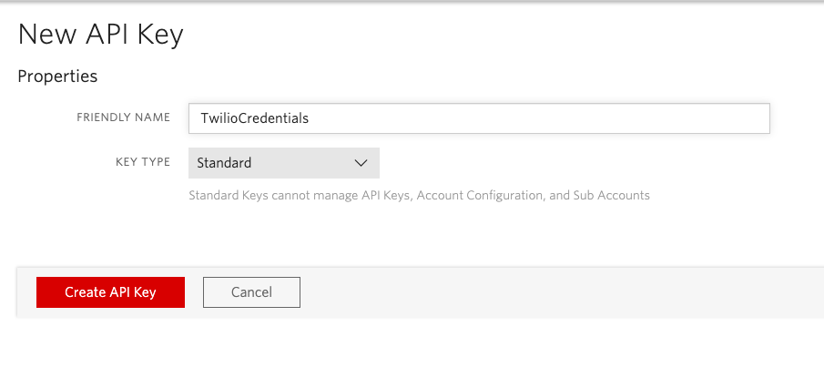

# Smitten Kitchen

Smitten Kitchen is a Web application that lets friends, family, and others to gather around to embrace and explore cultural heritage through online cooking classes. 

It is build using the following technologies:  React, [Twilio](https://www.twilio.com/try-twilio) for the videos , NPM, Material UI, and Framer Motion. 

## Preparing the application

To run the application you will need a [Twilio account](https://www.twilio.com/try-twilio) and Node.js and npm installed. Start by cloning or downloading the repo to your machine.

```bash
git clone https://github.com/philnash/twilio-video-react-hooks.git
cd twilio-video-react-hooks
```

Install the dependencies:

```bash
npm install
```
```bash
npm i npm-run-all
```

Create a `.env` file by copying the `.env.example`.

```bash
cp .env.example .env
```

### Credentials

You will need your Twilio Account SID, available in your [Twilio console](https://www.twilio.com/console). Add it to the `.env` file.

You will also need an API key SID and secret, you can create these under the [Programmable Video Tools in your console](https://www.twilio.com/console/video/project/api-keys). Create a key pair and add them to the `.env` file too. See image below.



## Running the application

Once you have completed the above you can run the application with:

```bash
npm run dev
```

This will open in your browser at [localhost:3000](http://localhost:3000).
